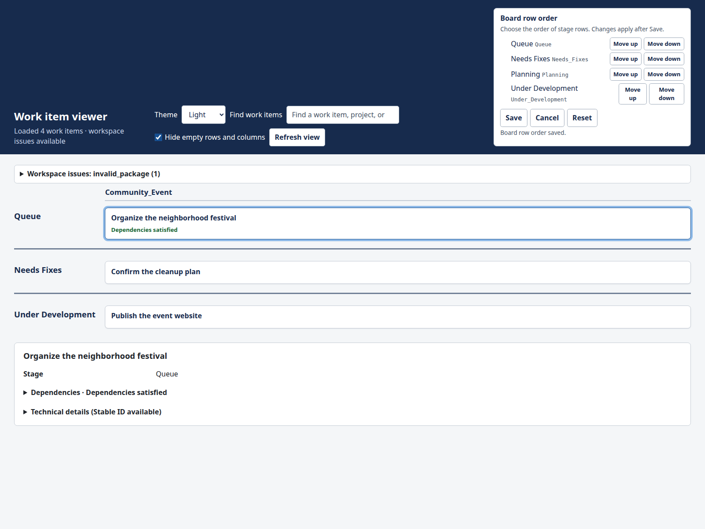

# Nyx

Nyx is a project management and tracking tool for software development that
brings your plans, progress, and dependencies together in a local browser view.
When work spans several features or repositories, it helps you see where each
effort stands, which pieces depend on one another, and what needs attention next.

Your specifications remain ordinary Markdown files, where you can develop an
idea, describe the intended behavior, and keep the context needed to carry it
through implementation and review. Nyx organizes that work into a board by
project and development stage, giving you an overview without having to open
each specification individually.

You create, edit, and move those files yourself with an editor or your existing
development tools, or you can use an LLM coding agent to help. Either way, the
files remain the shared record of the work, and Nyx provides a consistent place
to follow it. Nyx reads your specifications and displays the result; it does
not edit specifications or move them for you.



*The route preview can be designed from the completed API contract, but building
it still depends on an API implementation. Other web work needs fixes or review.*

## Following your projects

The board brings work from multiple projects into one view, with project columns
and rows for planning, queued work, implementation, fixes, review, completion,
and archived work. Dependency connections help you follow relationships within
and across projects, while card details explain the recorded prerequisites.

Search helps you find work by its title, project, or program—a named group of
related specifications. You can hide stages to focus on active work and still
inspect a hidden prerequisite through a visible card's details.

Your plans stay in files you can edit, keep in version control, and use with
other tools. Nyx runs locally on Linux, Windows, and macOS and opens in your browser. Setup and
runtime commands save account-local configuration and runtime state, but the
board itself remains a read-only view of the workspace.

## Try the sample

You need Linux, Windows, or macOS and Python 3.12. From the repository root,
use the commands for your host; virtual environment activation is not required.
After starting Nyx, explore the board before running the final stop command.

Linux or macOS (POSIX shell):

```bash
python3.12 -m venv .venv
.venv/bin/python -m pip install .
.venv/bin/nyx --setup examples/sample-specifications --show-all-stages
.venv/bin/nyx
.venv/bin/nyx --status
.venv/bin/nyx --stop
```

Windows PowerShell:

```powershell
py -3.12 -m venv .venv
.\.venv\Scripts\python.exe -m pip install .
.\.venv\Scripts\nyx.exe --setup .\examples\sample-specifications --show-all-stages
.\.venv\Scripts\nyx.exe
.\.venv\Scripts\nyx.exe --status
.\.venv\Scripts\nyx.exe --stop
```

Open **http://127.0.0.1:8765/**. Select **Build the route preview** to see why
its prerequisite is not yet satisfied, then compare it with **Plan the route
preview**. The [sample walkthrough](examples/sample-specifications/README.md)
explains the fictional project, its custom stage, and the compact-view workflow.

Throughout the linked guides, bare `nyx` is shorthand for the console installed
above: `.venv/bin/nyx` on Linux or macOS, or `.\.venv\Scripts\nyx.exe` in
Windows PowerShell. Those relative paths work from the repository root. When a
guide runs commands from another directory, use the absolute path to that same
console; quote paths containing spaces and use PowerShell's `&` before a quoted
executable path.

When files change, Nyx checks for an update every ten seconds. Click **Apply
update** when it appears to load the new view. **Refresh view** checks immediately
when no update is waiting. Use the stop command above when you are finished.

Setup saves the workspace location and configured stage visibility for your
account on this host. These setup choices are separate from the browser's personal
**Hide empty rows and columns** preference, which is stored only in that
browser. If Nyx is already running with a different setup, stop it before
changing the account-local settings. See [running Nyx](docs/running-nyx.md) for
status and configuration options.

Nyx stores configuration and runtime state in `.nyx` inside your home directory.
This is intentionally a fresh state root: legacy Linux state is neither read nor
migrated, and Nyx does not copy, remove, or fall back to it. Stop Nyx with your
existing installation before upgrading, then rerun setup with the new installation.
Setup saves an absolute workspace path local to that host; rerun setup on each
host using its local workspace location.

## Track your own work

Create a workspace with a directory for each project, organize specifications
under development stages, and point Nyx at that workspace. A specification is a
Markdown file named `spec.md` in its own directory. Its location supplies its
project and stage; its contents supply its title and other recorded information.

The [workspace guide](docs/workspaces.md) walks through your first specification,
moving work between stages, and adding dependencies when you need them.

Progress and dependency information comes from your specification files.
“Unblocked” means the recorded prerequisites are satisfied or none are listed.

## Working with coding agents

An LLM coding agent can help write specifications, update their recorded state,
and move them between stages as part of your development workflow. Give the
agent the same workspace structure and metadata conventions that you use
manually; Nyx reads the resulting files in either case.

This file-based workflow needs no model connection in Nyx. You choose the agent,
its access to your files, and the instructions and review process it follows.
Nyx itself does not launch agents or execute the work described by a specification.

## Documentation

- [Sample walkthrough](examples/sample-specifications/README.md): explore a small project.
- [Your specification workspace](docs/workspaces.md): create and organize your own work.
- [Running Nyx](docs/running-nyx.md): start, stop, check status, and choose visible stages.
- [Specification reference](docs/specification-reference.md): metadata, programs, and dependencies.

Nyx serves one local account on the fixed loopback address. The browser
is read-only; shared or remote hosting is not supported.
